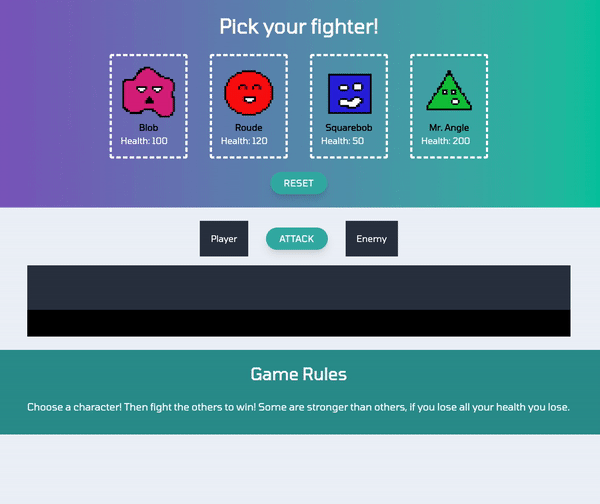

# unit-4-game-challenge

Very basic RPG fighter game. 

[Link to page](https://reekamaharaj.github.io/unit-4-game-challenge)

## How to play
User chooses a fighter and then has to beat all the others to win. There are no healing options, but the players attack power will go up after every attack. All attacks are countered by the opponent. all the fighters have different statistics. 

## Tech Used
- Tailwind CSS
- Visual Studio
- Javascript

## Role in App Development
Created fighter images, styled the app and coded the game mechanics.
